# GIAI ĐOẠN 3 (PHẦN 2): ACTIVITY DIAGRAMS & SEQUENCE DIAGRAMS

> [!NOTE]
> Tài liệu này thực hiện mục **6.4 (Activity Diagram)** và **6.5 (Sequence Diagram)** của [Planning.md](file:///f:/QUẢN-LÝ-SINH-VIÊN-2/Planning.md#L345-L381), bao gồm đầy đủ **7 Activity Diagrams** và **5 Sequence Diagrams** cốt lõi (trong đó có các sơ đồ bắt buộc của phân hệ Authentication & Authorization tại mục 9.3.6).
> Mỗi sơ đồ đều có Swimlane/Lifeline rõ ràng, thể hiện cả luồng thành công và các nhánh lỗi nghiệp vụ thực tế, kèm mã nguồn Mermaid & PlantUML.

---

## 1. ACTIVITY DIAGRAMS (MỤC 6.4)

### 1.1. Activity Diagram 1: Đăng nhập & Khởi tạo phiên (Login Flow)
- **Mục đích:** Mô tả luồng xử lý từ khi người dùng nhập thông tin đăng nhập đến khi kiểm tra mật khẩu, kiểm tra trạng thái tài khoản (`ACTIVE`/`LOCKED`), sinh cặp JWT + Refresh Token và điều hướng theo vai trò.
- **Phạm vi:** Liên kết giữa Người dùng, Frontend Next.js, Backend Spring Security và PostgreSQL.

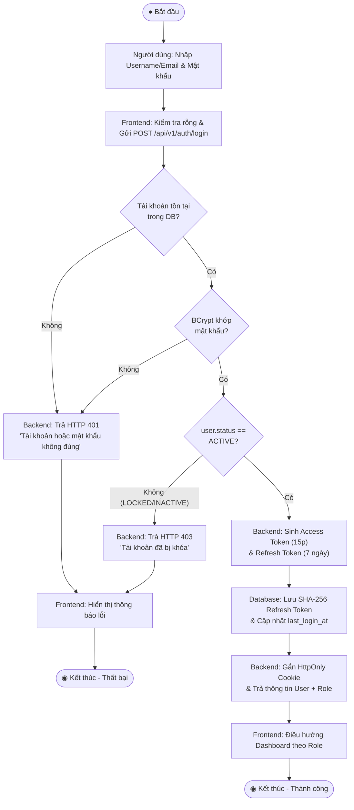
```mermaid
flowchart TD
    Start([● Bắt đầu]) --> A1["Người dùng: Nhập Username/Email & Mật khẩu"]
    A1 --> A2["Frontend: Kiểm tra rỗng & Gửi POST /api/v1/auth/login"]
    A2 --> D1{"Tài khoản tồn tại<br/>trong DB?"}
    D1 -- "Không" --> E1["Backend: Trả HTTP 401<br/>'Tài khoản hoặc mật khẩu không đúng'"]
    D1 -- "Có" --> D2{"BCrypt khớp<br/>mật khẩu?"}
    D2 -- "Không" --> E1
    D2 -- "Có" --> D3{"user.status ==<br/>ACTIVE?"}
    D3 -- "Không (LOCKED/INACTIVE)" --> E2["Backend: Trả HTTP 403<br/>'Tài khoản đã bị khóa'"]
    D3 -- "Có" --> F1["Backend: Sinh Access Token (15p)<br/>& Refresh Token (7 ngày)"]
    F1 --> F2["Database: Lưu SHA-256 Refresh Token<br/>& Cập nhật last_login_at"]
    F2 --> F3["Backend: Gắn HttpOnly Cookie<br/>& Trả thông tin User + Role"]
    F3 --> F4["Frontend: Điều hướng Dashboard theo Role"]
    E1 --> Merge["Frontend: Hiển thị thông báo lỗi"]
    E2 --> Merge
    Merge --> EndErr([◉ Kết thúc - Thất bại])
    F4 --> EndOk([◉ Kết thúc - Thành công])
```

#### Mã nguồn PlantUML (Activity Diagram 1 – Đăng nhập có Swimlane)
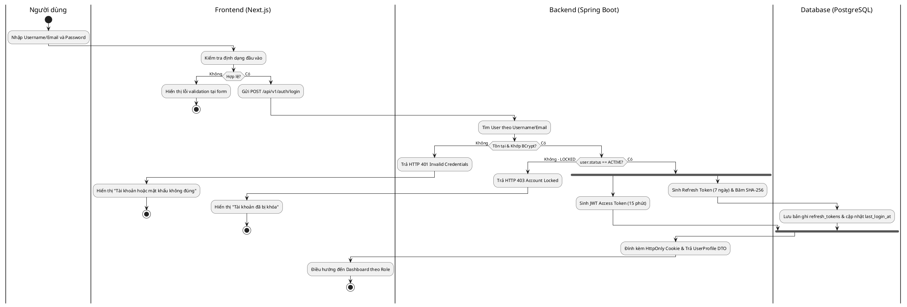
```plantuml
@startuml Activity_Login
|Người dùng|
start
:Nhập Username/Email và Password;
|Frontend (Next.js)|
:Kiểm tra định dạng đầu vào;
if (Hợp lệ?) then (Không)
  :Hiển thị lỗi validation tại form;
  stop
else (Có)
  :Gửi POST /api/v1/auth/login;
endif
|Backend (Spring Boot)|
:Tìm User theo Username/Email;
if (Tồn tại & Khớp BCrypt?) then (Không)
  :Trả HTTP 401 Invalid Credentials;
  |Frontend (Next.js)|
  :Hiển thị "Tài khoản hoặc mật khẩu không đúng";
  stop
else (Có)
  |Backend (Spring Boot)|
  if (user.status == ACTIVE?) then (Không - LOCKED)
    :Trả HTTP 403 Account Locked;
    |Frontend (Next.js)|
    :Hiển thị "Tài khoản đã bị khóa";
    stop
  else (Có)
    |Backend (Spring Boot)|
    fork
      :Sinh JWT Access Token (15 phút);
    fork again
      :Sinh Refresh Token (7 ngày) & Băm SHA-256;
      |Database (PostgreSQL)|
      :Lưu bản ghi refresh_tokens & cập nhật last_login_at;
    end fork
    |Backend (Spring Boot)|
    :Đính kèm HttpOnly Cookie & Trả UserProfile DTO;
    |Frontend (Next.js)|
    :Điều hướng đến Dashboard theo Role;
    stop
  endif
endif
@enduml
```

---

### 1.2. Activity Diagram 2: Quản lý Hồ sơ Sinh viên (Tạo mới & Tự động tạo User)
- **Mục đích:** Thể hiện luồng Phòng đào tạo thêm mới sinh viên (hoặc import file Excel) và tạo đồng bộ tài khoản `User` trong cùng một giao dịch.

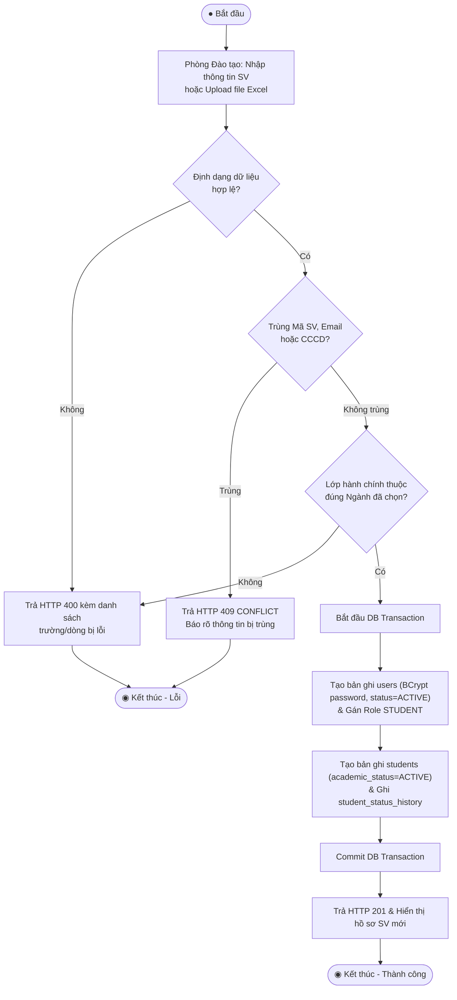
```mermaid
flowchart TD
    Start([● Bắt đầu]) --> A1["Phòng Đào tạo: Nhập thông tin SV<br/>hoặc Upload file Excel"]
    A1 --> D1{"Định dạng dữ liệu<br/>hợp lệ?"}
    D1 -- "Không" --> E1["Trả HTTP 400 kèm danh sách<br/>trường/dòng bị lỗi"]
    D1 -- "Có" --> D2{"Trùng Mã SV, Email<br/>hoặc CCCD?"}
    D2 -- "Trùng" --> E2["Trả HTTP 409 CONFLICT<br/>Báo rõ thông tin bị trùng"]
    D2 -- "Không trùng" --> D3{"Lớp hành chính thuộc<br/>đúng Ngành đã chọn?"}
    D3 -- "Không" --> E1
    D3 -- "Có" --> T1["Bắt đầu DB Transaction"]
    T1 --> T2["Tạo bản ghi users (BCrypt password, status=ACTIVE)<br/>& Gán Role STUDENT"]
    T2 --> T3["Tạo bản ghi students (academic_status=ACTIVE)<br/>& Ghi student_status_history"]
    T3 --> T4["Commit DB Transaction"]
    T4 --> Ok["Trả HTTP 201 & Hiển thị hồ sơ SV mới"]
    E1 --> EndErr([◉ Kết thúc - Lỗi])
    E2 --> EndErr
    Ok --> EndOk([◉ Kết thúc - Thành công])
```

#### Mã nguồn PlantUML (Activity Diagram 2)
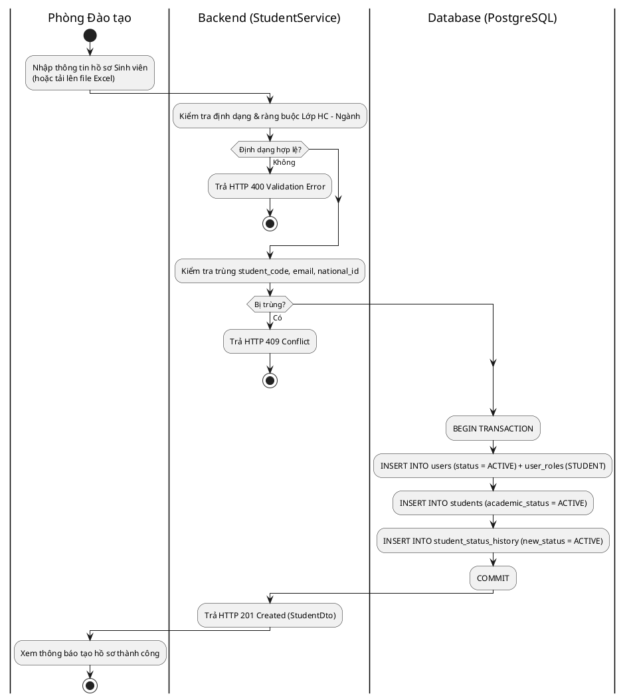
```plantuml
@startuml Activity_Manage_Student
|Phòng Đào tạo|
start
:Nhập thông tin hồ sơ Sinh viên\n(hoặc tải lên file Excel);
|Backend (StudentService)|
:Kiểm tra định dạng & ràng buộc Lớp HC - Ngành;
if (Định dạng hợp lệ?) then (Không)
  :Trả HTTP 400 Validation Error;
  stop
endif
:Kiểm tra trùng student_code, email, national_id;
if (Bị trùng?) then (Có)
  :Trả HTTP 409 Conflict;
  stop
endif
|Database (PostgreSQL)|
:BEGIN TRANSACTION;
:INSERT INTO users (status = ACTIVE) + user_roles (STUDENT);
:INSERT INTO students (academic_status = ACTIVE);
:INSERT INTO student_status_history (new_status = ACTIVE);
:COMMIT;
|Backend (StudentService)|
:Trả HTTP 201 Created (StudentDto);
|Phòng Đào tạo|
:Xem thông báo tạo hồ sơ thành công;
stop
@enduml
```

---

### 1.3. Activity Diagram 3: Mở Lớp học phần & Kiểm tra trùng lịch 2 chiều (Phòng học & Giảng viên)
- **Mục đích:** Mô tả quy trình mở lớp học phần và thuật toán kiểm tra xung đột sức chứa phòng học, lịch phòng học và lịch giảng dạy của giảng viên (`BR-14` → `BR-17`).

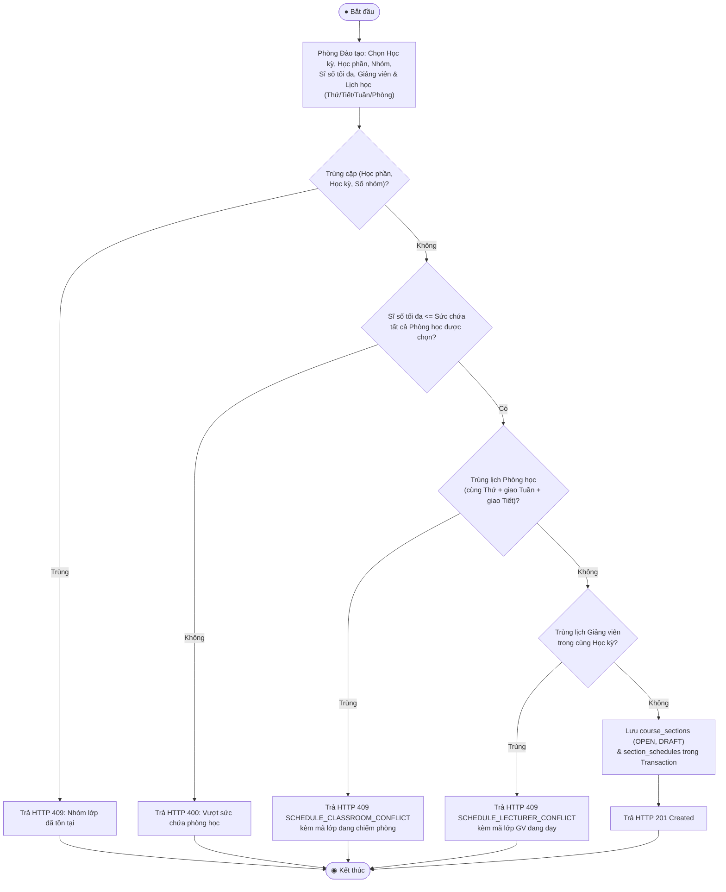
```mermaid
flowchart TD
    Start([● Bắt đầu]) --> A1["Phòng Đào tạo: Chọn Học kỳ, Học phần, Nhóm,<br/>Sĩ số tối đa, Giảng viên & Lịch học (Thứ/Tiết/Tuần/Phòng)"]
    A1 --> D1{"Trùng cặp (Học phần,<br/>Học kỳ, Số nhóm)?"}
    D1 -- "Trùng" --> E1["Trả HTTP 409: Nhóm lớp đã tồn tại"]
    D1 -- "Không" --> D2{"Sĩ số tối đa <= Sức chứa<br/>tất cả Phòng học được chọn?"}
    D2 -- "Không" --> E2["Trả HTTP 400: Vượt sức chứa phòng học"]
    D2 -- "Có" --> D3{"Trùng lịch Phòng học<br/>(cùng Thứ + giao Tuần + giao Tiết)?"}
    D3 -- "Trùng" --> E3["Trả HTTP 409 SCHEDULE_CLASSROOM_CONFLICT<br/>kèm mã lớp đang chiếm phòng"]
    D3 -- "Không" --> D4{"Trùng lịch Giảng viên<br/>trong cùng Học kỳ?"}
    D4 -- "Trùng" --> E4["Trả HTTP 409 SCHEDULE_LECTURER_CONFLICT<br/>kèm mã lớp GV đang dạy"]
    D4 -- "Không" --> S1["Lưu course_sections (OPEN, DRAFT)<br/>& section_schedules trong Transaction"]
    S1 --> Ok["Trả HTTP 201 Created"]
    E1 --> End([◉ Kết thúc])
    E2 --> End
    E3 --> End
    E4 --> End
    Ok --> End
```

#### Mã nguồn PlantUML (Activity Diagram 3)
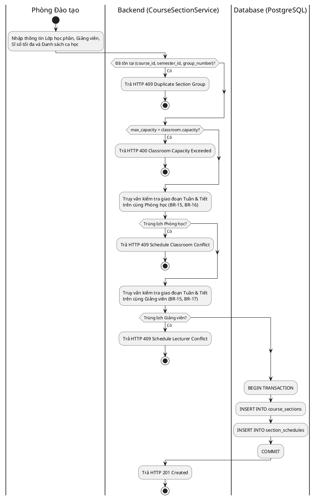
```plantuml
@startuml Activity_Open_Course_Section
|Phòng Đào tạo|
start
:Nhập thông tin Lớp học phần, Giảng viên,\nSĩ số tối đa và Danh sách ca học;
|Backend (CourseSectionService)|
if (Đã tồn tại (course_id, semester_id, group_number)?) then (Có)
  :Trả HTTP 409 Duplicate Section Group;
  stop
endif
if (max_capacity > classroom.capacity?) then (Có)
  :Trả HTTP 400 Classroom Capacity Exceeded;
  stop
endif
:Truy vấn kiểm tra giao đoạn Tuần & Tiết\ntrên cùng Phòng học (BR-15, BR-16);
if (Trùng lịch Phòng học?) then (Có)
  :Trả HTTP 409 Schedule Classroom Conflict;
  stop
endif
:Truy vấn kiểm tra giao đoạn Tuần & Tiết\ntrên cùng Giảng viên (BR-15, BR-17);
if (Trùng lịch Giảng viên?) then (Có)
  :Trả HTTP 409 Schedule Lecturer Conflict;
  stop
endif
|Database (PostgreSQL)|
:BEGIN TRANSACTION;
:INSERT INTO course_sections;
:INSERT INTO section_schedules;
:COMMIT;
|Backend (CourseSectionService)|
:Trả HTTP 201 Created;
stop
@enduml
```

---

### 1.4. Activity Diagram 4: Đăng ký học phần (Trọng tâm — Kiểm tra 7 điều kiện & Khóa dòng `FOR UPDATE`)
- **Mục đích:** Mô tả đầy đủ từng bước kiểm tra điều kiện đăng ký học phần của sinh viên và cơ chế khóa bi quan (`SELECT ... FOR UPDATE`) chống vượt sĩ số khi nhiều người đăng ký cùng lúc.

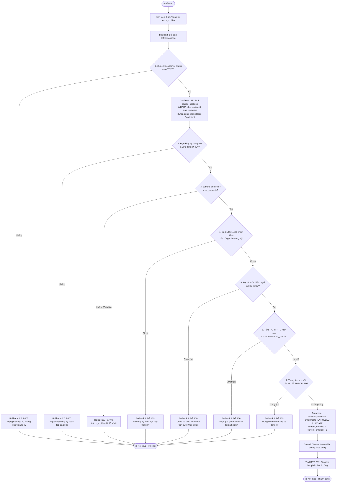
```mermaid
flowchart TD
    Start([● Bắt đầu]) --> A1["Sinh viên: Bấm 'Đăng ký' lớp học phần"]
    A1 --> T1["Backend: Bắt đầu @Transactional"]
    T1 --> D1{"1. student.academic_status<br/>== ACTIVE?"}
    D1 -- "Không" --> R1["Rollback & Trả 403:<br/>Trạng thái học vụ không được đăng ký"]
    D1 -- "Có" --> L1["Database: SELECT course_sections<br/>WHERE id = :sectionId FOR UPDATE<br/>(Khóa dòng chống Race Condition)"]
    L1 --> D2{"2. Đợt đăng ký đang mở<br/>& Lớp đang OPEN?"}
    D2 -- "Không" --> R2["Rollback & Trả 400:<br/>Ngoài đợt đăng ký hoặc lớp đã đóng"]
    D2 -- "Có" --> D3{"3. current_enrolled <<br/>max_capacity?"}
    D3 -- "Không (Đã đầy)" --> R3["Rollback & Trả 409:<br/>Lớp học phần đã đủ sĩ số"]
    D3 -- "Có" --> D4{"4. Đã ENROLLED nhóm khác<br/>của cùng môn trong kỳ?"}
    D4 -- "Đã có" --> R4["Rollback & Trả 409:<br/>Đã đăng ký môn học này trong kỳ"]
    D4 -- "Chưa" --> D5{"5. Đạt đủ môn Tiên quyết<br/>& Học trước?"}
    D5 -- "Chưa đạt" --> R5["Rollback & Trả 400:<br/>Chưa đủ điều kiện môn tiên quyết/học trước"]
    D5 -- "Đạt" --> D6{"6. Tổng TC kỳ + TC môn mới<br/><= semester.max_credits?"}
    D6 -- "Vượt quá" --> R6["Rollback & Trả 400:<br/>Vượt quá giới hạn tín chỉ tối đa học kỳ"]
    D6 -- "Hợp lệ" --> D7{"7. Trùng lịch học với<br/>các lớp đã ENROLLED?"}
    D7 -- "Trùng lịch" --> R7["Rollback & Trả 409:<br/>Trùng lịch học với lớp đã đăng ký"]
    D7 -- "Không trùng" --> W1["Database: INSERT/UPDATE enrollments (ENROLLED)<br/>& UPDATE current_enrolled = current_enrolled + 1"]
    W1 --> C1["Commit Transaction & Giải phóng khóa dòng"]
    C1 --> Ok["Trả HTTP 201: Đăng ký học phần thành công"]

    R1 --> EndErr([◉ Kết thúc - Từ chối])
    R2 --> EndErr
    R3 --> EndErr
    R4 --> EndErr
    R5 --> EndErr
    R6 --> EndErr
    R7 --> EndErr
    Ok --> EndOk([◉ Kết thúc - Thành công])
```

#### Mã nguồn PlantUML (Activity Diagram 4 – Đăng ký học phần)
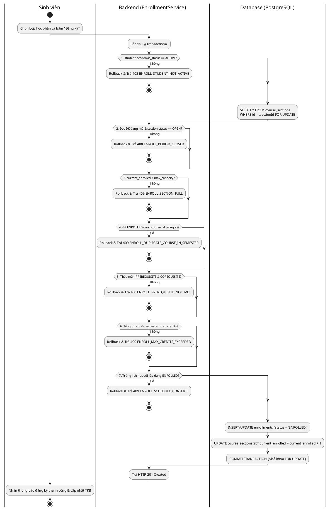
```plantuml
@startuml Activity_Course_Enrollment
|Sinh viên|
start
:Chọn Lớp học phần và bấm "Đăng ký";
|Backend (EnrollmentService)|
:Bắt đầu @Transactional;
if (1. student.academic_status == ACTIVE?) then (Không)
  :Rollback & Trả 403 ENROLL_STUDENT_NOT_ACTIVE;
  stop
endif
|Database (PostgreSQL)|
:SELECT * FROM course_sections\nWHERE id = :sectionId FOR UPDATE;
|Backend (EnrollmentService)|
if (2. Đợt ĐK đang mở & section.status == OPEN?) then (Không)
  :Rollback & Trả 400 ENROLL_PERIOD_CLOSED;
  stop
endif
if (3. current_enrolled < max_capacity?) then (Không)
  :Rollback & Trả 409 ENROLL_SECTION_FULL;
  stop
endif
if (4. Đã ENROLLED cùng course_id trong kỳ?) then (Có)
  :Rollback & Trả 409 ENROLL_DUPLICATE_COURSE_IN_SEMESTER;
  stop
endif
if (5. Thỏa mãn PREREQUISITE & COREQUISITE?) then (Không)
  :Rollback & Trả 400 ENROLL_PREREQUISITE_NOT_MET;
  stop
endif
if (6. Tổng tín chỉ <= semester.max_credits?) then (Không)
  :Rollback & Trả 400 ENROLL_MAX_CREDITS_EXCEEDED;
  stop
endif
if (7. Trùng lịch học với lớp đang ENROLLED?) then (Có)
  :Rollback & Trả 409 ENROLL_SCHEDULE_CONFLICT;
  stop
endif
|Database (PostgreSQL)|
:INSERT/UPDATE enrollments (status = 'ENROLLED');
:UPDATE course_sections SET current_enrolled = current_enrolled + 1;
:COMMIT TRANSACTION (Nhả khóa FOR UPDATE);
|Backend (EnrollmentService)|
:Trả HTTP 201 Created;
|Sinh viên|
:Nhận thông báo đăng ký thành công & cập nhật TKB;
stop
@enduml
```

---

### 1.5. Activity Diagram 5: Hủy đăng ký học phần
- **Mục đích:** Mô tả luồng sinh viên tự hủy đăng ký trong đợt mở (hoặc Phòng đào tạo hủy hộ có lý do), đổi trạng thái sang `CANCELLED` và hoàn lại 1 suất trống cho lớp học phần.

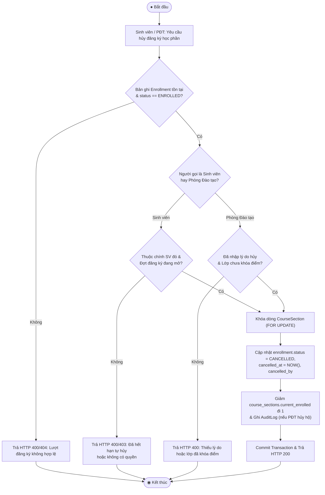
```mermaid
flowchart TD
    Start([● Bắt đầu]) --> A1["Sinh viên / PĐT: Yêu cầu hủy đăng ký học phần"]
    A1 --> D1{"Bản ghi Enrollment tồn tại<br/>& status == ENROLLED?"}
    D1 -- "Không" --> E1["Trả HTTP 400/404: Lượt đăng ký không hợp lệ"]
    D1 -- "Có" --> D2{"Người gọi là Sinh viên<br/>hay Phòng Đào tạo?"}
    D2 -- "Sinh viên" --> D3{"Thuộc chính SV đó &<br/>Đợt đăng ký đang mở?"}
    D3 -- "Không" --> E2["Trả HTTP 400/403: Đã hết hạn tự hủy<br/>hoặc không có quyền"]
    D2 -- "Phòng Đào tạo" --> D4{"Đã nhập lý do hủy<br/>& Lớp chưa khóa điểm?"}
    D4 -- "Không" --> E3["Trả HTTP 400: Thiếu lý do hoặc lớp đã khóa điểm"]
    D3 -- "Có" --> L1["Khóa dòng CourseSection (FOR UPDATE)"]
    D4 -- "Có" --> L1
    L1 --> U1["Cập nhật enrollment.status = CANCELLED,<br/>cancelled_at = NOW(), cancelled_by"]
    U1 --> U2["Giảm course_sections.current_enrolled đi 1<br/>& Ghi AuditLog (nếu PĐT hủy hộ)"]
    U2 --> C1["Commit Transaction & Trả HTTP 200"]
    E1 --> End([◉ Kết thúc])
    E2 --> End
    E3 --> End
    C1 --> End
```

#### Mã nguồn PlantUML (Activity Diagram 5)
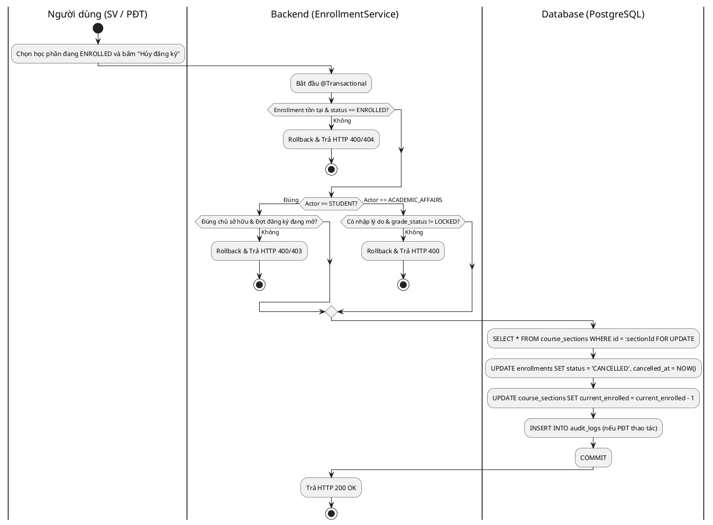
```plantuml
@startuml Activity_Cancel_Enrollment
|Người dùng (SV / PĐT)|
start
:Chọn học phần đang ENROLLED và bấm "Hủy đăng ký";
|Backend (EnrollmentService)|
:Bắt đầu @Transactional;
if (Enrollment tồn tại & status == ENROLLED?) then (Không)
  :Rollback & Trả HTTP 400/404;
  stop
endif
if (Actor == STUDENT?) then (Đúng)
  if (Đúng chủ sở hữu & Đợt đăng ký đang mở?) then (Không)
    :Rollback & Trả HTTP 400/403;
    stop
  endif
else (Actor == ACADEMIC_AFFAIRS)
  if (Có nhập lý do & grade_status != LOCKED?) then (Không)
    :Rollback & Trả HTTP 400;
    stop
  endif
endif
|Database (PostgreSQL)|
:SELECT * FROM course_sections WHERE id = :sectionId FOR UPDATE;
:UPDATE enrollments SET status = 'CANCELLED', cancelled_at = NOW();
:UPDATE course_sections SET current_enrolled = current_enrolled - 1;
:INSERT INTO audit_logs (nếu PĐT thao tác);
:COMMIT;
|Backend (EnrollmentService)|
:Trả HTTP 200 OK;
stop
@enduml
```

---

### 1.6. Activity Diagram 6: Nhập, Tính tự động, Công bố và Khóa điểm
- **Mục đích:** Thể hiện luồng nhập điểm của Giảng viên, tự động tính điểm tổng kết + xét điểm liệt cuối kỳ (`< 4.0`), công bố điểm (`PUBLISHED`) và khóa sổ điểm (`LOCKED`) bởi Phòng đào tạo.

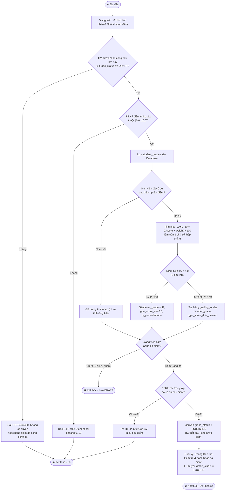
```mermaid
flowchart TD
    Start([● Bắt đầu]) --> A1["Giảng viên: Mở lớp học phần & Nhập/Import điểm"]
    A1 --> D1{"GV được phân công dạy lớp này<br/>& grade_status == DRAFT?"}
    D1 -- "Không" --> E1["Trả HTTP 403/400: Không có quyền<br/>hoặc bảng điểm đã công bố/khóa"]
    D1 -- "Có" --> D2{"Tất cả điểm nhập vào<br/>thuộc [0.0, 10.0]?"}
    D2 -- "Không" --> E2["Trả HTTP 400: Điểm ngoài khoảng 0..10"]
    D2 -- "Có" --> S1["Lưu student_grades vào Database"]
    S1 --> D3{"Sinh viên đã có đủ<br/>các thành phần điểm?"}
    D3 -- "Chưa đủ" --> S2["Giữ trạng thái nháp (chưa tính tổng kết)"]
    D3 -- "Đã đủ" --> C1["Tính final_score_10 = Σ(score × weight) / 100<br/>(làm tròn 1 chữ số thập phân)"]
    C1 --> D4{"Điểm Cuối kỳ < 4.0<br/>(Điểm liệt)?"}
    D4 -- "Có (< 4.0)" --> F1["Gán letter_grade = 'F',<br/>gpa_score_4 = 0.0, is_passed = false"]
    D4 -- "Không (>= 4.0)" --> F2["Tra bảng grading_scales<br/>-> letter_grade, gpa_score_4, is_passed"]
    F1 --> P1{"Giảng viên bấm<br/>'Công bố điểm'?"}
    F2 --> P1
    S2 --> P1
    P1 -- "Chưa (Chỉ lưu nháp)" --> EndDraft([◉ Kết thúc - Lưu DRAFT])
    P1 -- "Bấm Công bố" --> D5{"100% SV trong lớp<br/>đã có đủ đầu điểm?"}
    D5 -- "Chưa đủ" --> E3["Trả HTTP 400: Còn SV thiếu đầu điểm"]
    D5 -- "Đã đủ" --> P2["Chuyển grade_status = PUBLISHED<br/>(SV bắt đầu xem được điểm)"]
    P2 --> L1["Cuối kỳ: Phòng Đào tạo kiểm tra & bấm 'Khóa sổ điểm'<br/>-> Chuyển grade_status = LOCKED"]
    L1 --> EndOk([◉ Kết thúc - Đã khóa sổ])
    E1 --> EndErr([◉ Kết thúc - Lỗi])
    E2 --> EndErr
    E3 --> EndErr
```

#### Mã nguồn PlantUML (Activity Diagram 6)
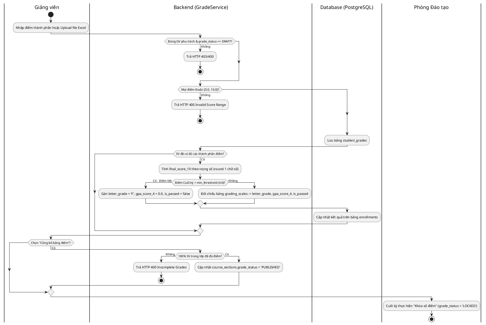
```plantuml
@startuml Activity_Grade_Management
|Giảng viên|
start
:Nhập điểm thành phần hoặc Upload file Excel;
|Backend (GradeService)|
if (Đúng GV phụ trách & grade_status == DRAFT?) then (Không)
  :Trả HTTP 403/400;
  stop
endif
if (Mọi điểm thuộc [0.0, 10.0]?) then (Không)
  :Trả HTTP 400 Invalid Score Range;
  stop
endif
|Database (PostgreSQL)|
:Lưu bảng student_grades;
|Backend (GradeService)|
if (SV đã có đủ các thành phần điểm?) then (Có)
  :Tính final_score_10 theo trọng số (round 1 chữ số);
  if (Điểm Cuối kỳ < min_threshold (4.0)?) then (Có - Điểm liệt)
    :Gán letter_grade = 'F', gpa_score_4 = 0.0, is_passed = false;
  else (Không)
    :Đối chiếu bảng grading_scales -> letter_grade, gpa_score_4, is_passed;
  endif
  |Database (PostgreSQL)|
  :Cập nhật kết quả trên bảng enrollments;
endif
|Giảng viên|
if (Chọn "Công bố bảng điểm"?) then (Có)
  |Backend (GradeService)|
  if (100% SV trong lớp đã đủ điểm?) then (Không)
    :Trả HTTP 400 Incomplete Grades;
    stop
  else (Có)
    :Cập nhật course_sections.grade_status = 'PUBLISHED';
  endif
endif
|Phòng Đào tạo|
:Cuối kỳ thực hiện "Khóa sổ điểm" (grade_status = 'LOCKED');
stop
@enduml
```

---

### 1.7. Activity Diagram 7: Tra cứu Kết quả học tập & Tính GPA/CPA (xử lý môn học lại)
- **Mục đích:** Mô tả cách hệ thống lọc các lớp đã công bố điểm, tính GPA từng học kỳ và tính CPA tích lũy theo quy tắc lấy điểm cao nhất khi học lại/cải thiện (`BR-30`, `BR-31`).

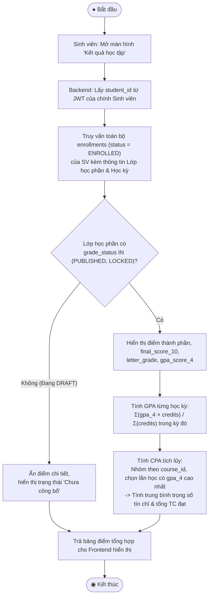
```mermaid
flowchart TD
    Start([● Bắt đầu]) --> A1["Sinh viên: Mở màn hình 'Kết quả học tập'"]
    A1 --> B1["Backend: Lấy student_id từ JWT của chính Sinh viên"]
    B1 --> B2["Truy vấn toàn bộ enrollments (status = ENROLLED)<br/>của SV kèm thông tin Lớp học phần & Học kỳ"]
    B2 --> D1{"Lớp học phần có<br/>grade_status IN (PUBLISHED, LOCKED)?"}
    D1 -- "Không (Đang DRAFT)" --> H1["Ẩn điểm chi tiết,<br/>hiển thị trạng thái 'Chưa công bố'"]
    D1 -- "Có" --> H2["Hiển thị điểm thành phần, final_score_10,<br/>letter_grade, gpa_score_4"]
    H2 --> G1["Tính GPA từng học kỳ:<br/>Σ(gpa_4 × credits) / Σ(credits) trong kỳ đó"]
    G1 --> G2["Tính CPA tích lũy:<br/>Nhóm theo course_id, chọn lần học có gpa_4 cao nhất<br/>-> Tính trung bình trọng số tín chỉ & tổng TC đạt"]
    H1 --> Out["Trả bảng điểm tổng hợp cho Frontend hiển thị"]
    G2 --> Out
    Out --> End([◉ Kết thúc])
```

#### Mã nguồn PlantUML (Activity Diagram 7)
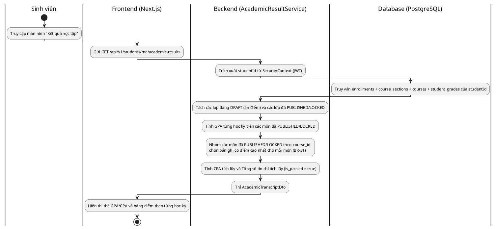
```plantuml
@startuml Activity_View_Academic_Results
|Sinh viên|
start
:Truy cập màn hình "Kết quả học tập";
|Frontend (Next.js)|
:Gửi GET /api/v1/students/me/academic-results;
|Backend (AcademicResultService)|
:Trích xuất studentId từ SecurityContext (JWT);
|Database (PostgreSQL)|
:Truy vấn enrollments + course_sections + courses + student_grades của studentId;
|Backend (AcademicResultService)|
:Tách các lớp đang DRAFT (ẩn điểm) và các lớp đã PUBLISHED/LOCKED;
:Tính GPA từng học kỳ trên các môn đã PUBLISHED/LOCKED;
:Nhóm các môn đã PUBLISHED/LOCKED theo course_id,\nchọn bản ghi có điểm cao nhất cho mỗi môn (BR-31);
:Tính CPA tích lũy và Tổng số tín chỉ tích lũy (is_passed = true);
:Trả AcademicTranscriptDto;
|Frontend (Next.js)|
:Hiển thị thẻ GPA/CPA và bảng điểm theo từng học kỳ;
stop
@enduml
```

---

## 2. SEQUENCE DIAGRAMS (MỤC 6.5 & 9.3.6)

### 2.1. Sequence Diagram 1: Luồng Đăng nhập (Authentication Sequence — Bắt buộc Mục 9.3.6)

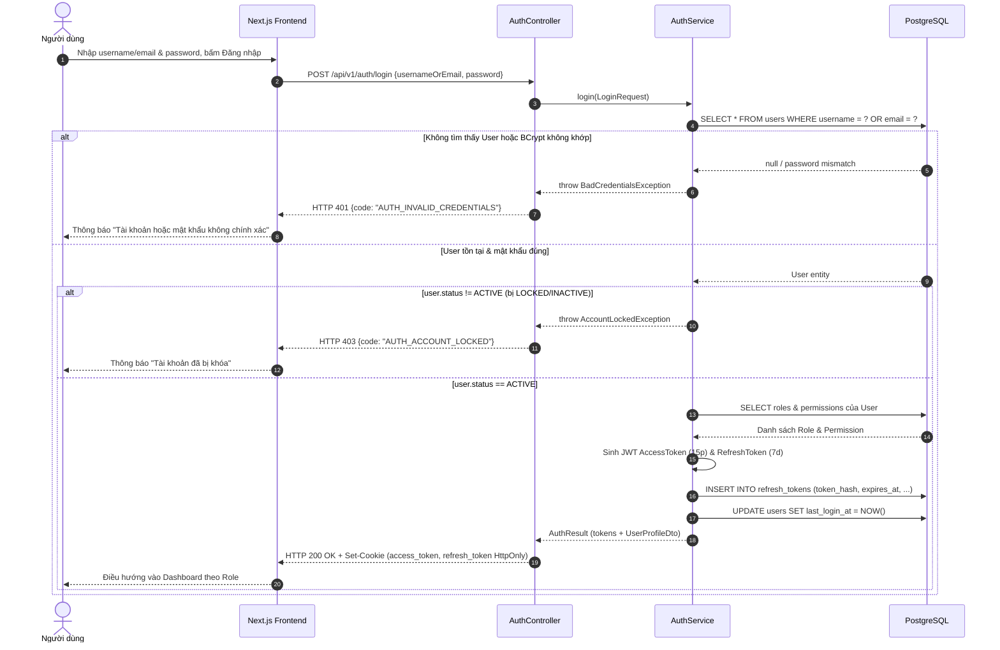
```mermaid
sequenceDiagram
    autonumber
    actor User as Người dùng
    participant FE as Next.js Frontend
    participant API as AuthController
    participant SVC as AuthService
    participant DB as PostgreSQL

    User->>FE: Nhập username/email & password, bấm Đăng nhập
    FE->>API: POST /api/v1/auth/login {usernameOrEmail, password}
    API->>SVC: login(LoginRequest)
    SVC->>DB: SELECT * FROM users WHERE username = ? OR email = ?
    alt Không tìm thấy User hoặc BCrypt không khớp
        DB-->>SVC: null / password mismatch
        SVC-->>API: throw BadCredentialsException
        API-->>FE: HTTP 401 {code: "AUTH_INVALID_CREDENTIALS"}
        FE-->>User: Thông báo "Tài khoản hoặc mật khẩu không chính xác"
    else User tồn tại & mật khẩu đúng
        DB-->>SVC: User entity
        alt user.status != ACTIVE (bị LOCKED/INACTIVE)
            SVC-->>API: throw AccountLockedException
            API-->>FE: HTTP 403 {code: "AUTH_ACCOUNT_LOCKED"}
            FE-->>User: Thông báo "Tài khoản đã bị khóa"
        else user.status == ACTIVE
            SVC->>DB: SELECT roles & permissions của User
            DB-->>SVC: Danh sách Role & Permission
            SVC->>SVC: Sinh JWT AccessToken (15p) & RefreshToken (7d)
            SVC->>DB: INSERT INTO refresh_tokens (token_hash, expires_at, ...)
            SVC->>DB: UPDATE users SET last_login_at = NOW()
            SVC-->>API: AuthResult (tokens + UserProfileDto)
            API-->>FE: HTTP 200 OK + Set-Cookie (access_token, refresh_token HttpOnly)
            FE-->>User: Điều hướng vào Dashboard theo Role
        end
    end
```

#### Mã nguồn PlantUML (Sequence Diagram 1)
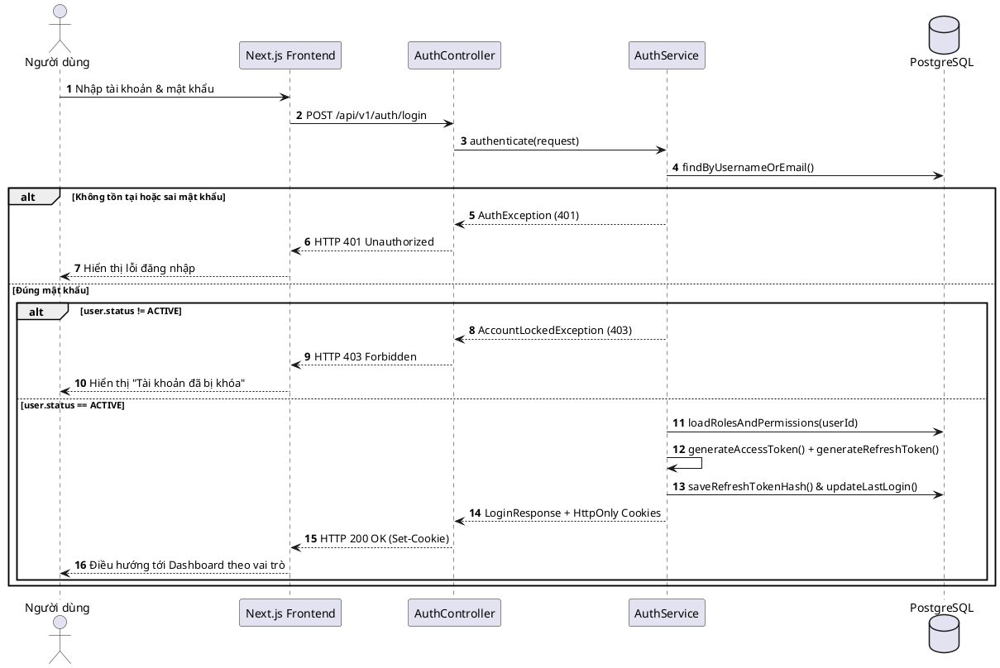
```plantuml
@startuml Sequence_Login
autonumber
actor "Người dùng" as User
participant "Next.js Frontend" as FE
participant "AuthController" as API
participant "AuthService" as SVC
database "PostgreSQL" as DB

User -> FE : Nhập tài khoản & mật khẩu
FE -> API : POST /api/v1/auth/login
API -> SVC : authenticate(request)
SVC -> DB : findByUsernameOrEmail()
alt Không tồn tại hoặc sai mật khẩu
  SVC --> API : AuthException (401)
  API --> FE : HTTP 401 Unauthorized
  FE --> User : Hiển thị lỗi đăng nhập
else Đúng mật khẩu
  alt user.status != ACTIVE
    SVC --> API : AccountLockedException (403)
    API --> FE : HTTP 403 Forbidden
    FE --> User : Hiển thị "Tài khoản đã bị khóa"
  else user.status == ACTIVE
    SVC -> DB : loadRolesAndPermissions(userId)
    SVC -> SVC : generateAccessToken() + generateRefreshToken()
    SVC -> DB : saveRefreshTokenHash() & updateLastLogin()
    SVC --> API : LoginResponse + HttpOnly Cookies
    API --> FE : HTTP 200 OK (Set-Cookie)
    FE --> User : Điều hướng tới Dashboard theo vai trò
  end
end
@enduml
```

---

### 2.2. Sequence Diagram 2: Luồng Kiểm tra Quyền RBAC & Data-Scope (Authorization Sequence — Bắt buộc Mục 9.3.6)

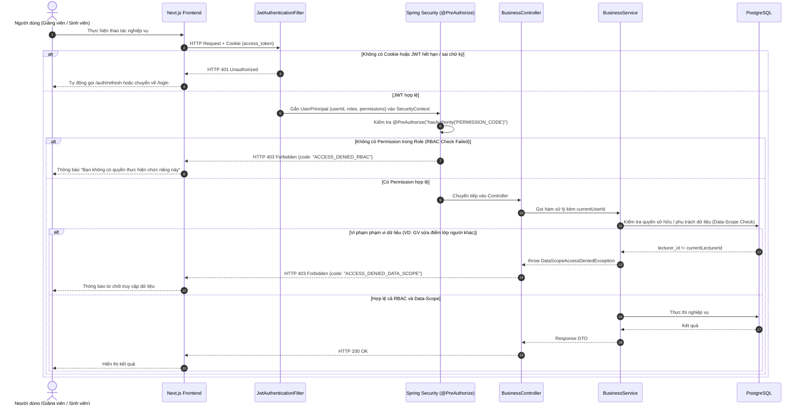
```mermaid
sequenceDiagram
    autonumber
    actor User as Người dùng (Giảng viên / Sinh viên)
    participant FE as Next.js Frontend
    participant FLT as JwtAuthenticationFilter
    participant SEC as Spring Security (@PreAuthorize)
    participant CTL as BusinessController
    participant SVC as BusinessService
    participant DB as PostgreSQL

    User->>FE: Thực hiện thao tác nghiệp vụ
    FE->>FLT: HTTP Request + Cookie (access_token)
    alt Không có Cookie hoặc JWT hết hạn / sai chữ ký
        FLT-->>FE: HTTP 401 Unauthorized
        FE-->>User: Tự động gọi /auth/refresh hoặc chuyển về /login
    else JWT hợp lệ
        FLT->>SEC: Gắn UserPrincipal (userId, roles, permissions) vào SecurityContext
        SEC->>SEC: Kiểm tra @PreAuthorize("hasAuthority('PERMISSION_CODE')")
        alt Không có Permission trong Role (RBAC Check Failed)
            SEC-->>FE: HTTP 403 Forbidden {code: "ACCESS_DENIED_RBAC"}
            FE-->>User: Thông báo "Bạn không có quyền thực hiện chức năng này"
        else Có Permission hợp lệ
            SEC->>CTL: Chuyển tiếp vào Controller
            CTL->>SVC: Gọi hàm xử lý kèm currentUserId
            SVC->>DB: Kiểm tra quyền sở hữu / phụ trách dữ liệu (Data-Scope Check)
            alt Vi phạm phạm vi dữ liệu (VD: GV sửa điểm lớp người khác)
                DB-->>SVC: lecturer_id != currentLecturerId
                SVC-->>CTL: throw DataScopeAccessDeniedException
                CTL-->>FE: HTTP 403 Forbidden {code: "ACCESS_DENIED_DATA_SCOPE"}
                FE-->>User: Thông báo từ chối truy cập dữ liệu
            else Hợp lệ cả RBAC và Data-Scope
                SVC->>DB: Thực thi nghiệp vụ
                DB-->>SVC: Kết quả
                SVC-->>CTL: Response DTO
                CTL-->>FE: HTTP 200 OK
                FE-->>User: Hiển thị kết quả
            end
        end
    end
```

#### Mã nguồn PlantUML (Sequence Diagram 2)
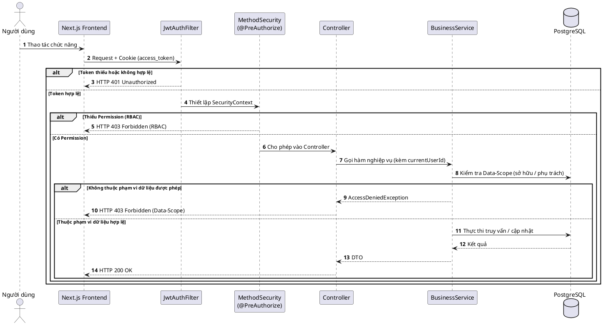
```plantuml
@startuml Sequence_Authorization_Check
autonumber
actor "Người dùng" as User
participant "Next.js Frontend" as FE
participant "JwtAuthFilter" as Filter
participant "MethodSecurity\n(@PreAuthorize)" as RBAC
participant "Controller" as CTL
participant "BusinessService" as SVC
database "PostgreSQL" as DB

User -> FE : Thao tác chức năng
FE -> Filter : Request + Cookie (access_token)
alt Token thiếu hoặc không hợp lệ
  Filter --> FE : HTTP 401 Unauthorized
else Token hợp lệ
  Filter -> RBAC : Thiết lập SecurityContext
  alt Thiếu Permission (RBAC)
    RBAC --> FE : HTTP 403 Forbidden (RBAC)
  else Có Permission
    RBAC -> CTL : Cho phép vào Controller
    CTL -> SVC : Gọi hàm nghiệp vụ (kèm currentUserId)
    SVC -> DB : Kiểm tra Data-Scope (sở hữu / phụ trách)
    alt Không thuộc phạm vi dữ liệu được phép
      SVC --> CTL : AccessDeniedException
      CTL --> FE : HTTP 403 Forbidden (Data-Scope)
    else Thuộc phạm vi dữ liệu hợp lệ
      SVC -> DB : Thực thi truy vấn / cập nhật
      DB --> SVC : Kết quả
      SVC --> CTL : DTO
      CTL --> FE : HTTP 200 OK
    end
  end
end
@enduml
```

---

### 2.3. Sequence Diagram 3: Đăng ký học phần có Khóa dòng `FOR UPDATE` (Xử lý đồng thời)

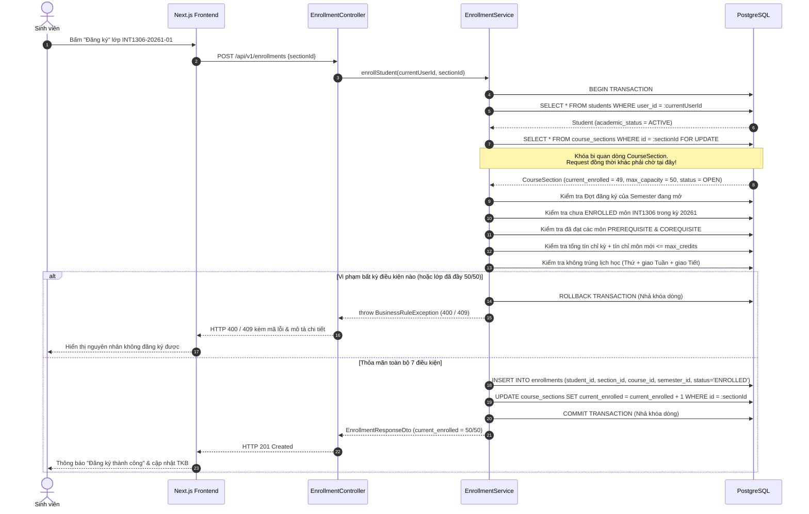
```mermaid
sequenceDiagram
    autonumber
    actor Stu as Sinh viên
    participant FE as Next.js Frontend
    participant CTL as EnrollmentController
    participant SVC as EnrollmentService
    participant DB as PostgreSQL

    Stu->>FE: Bấm "Đăng ký" lớp INT1306-20261-01
    FE->>CTL: POST /api/v1/enrollments {sectionId}
    CTL->>SVC: enrollStudent(currentUserId, sectionId)
    SVC->>DB: BEGIN TRANSACTION
    SVC->>DB: SELECT * FROM students WHERE user_id = :currentUserId
    DB-->>SVC: Student (academic_status = ACTIVE)
    SVC->>DB: SELECT * FROM course_sections WHERE id = :sectionId FOR UPDATE
    Note over SVC,DB: Khóa bi quan dòng CourseSection.<br/>Request đồng thời khác phải chờ tại đây!
    DB-->>SVC: CourseSection (current_enrolled = 49, max_capacity = 50, status = OPEN)
    SVC->>DB: Kiểm tra Đợt đăng ký của Semester đang mở
    SVC->>DB: Kiểm tra chưa ENROLLED môn INT1306 trong kỳ 20261
    SVC->>DB: Kiểm tra đã đạt các môn PREREQUISITE & COREQUISITE
    SVC->>DB: Kiểm tra tổng tín chỉ kỳ + tín chỉ môn mới <= max_credits
    SVC->>DB: Kiểm tra không trùng lịch học (Thứ + giao Tuần + giao Tiết)
    alt Vi phạm bất kỳ điều kiện nào (hoặc lớp đã đầy 50/50)
        SVC->>DB: ROLLBACK TRANSACTION (Nhả khóa dòng)
        SVC-->>CTL: throw BusinessRuleException (400 / 409)
        CTL-->>FE: HTTP 400 / 409 kèm mã lỗi & mô tả chi tiết
        FE-->>Stu: Hiển thị nguyên nhân không đăng ký được
    else Thỏa mãn toàn bộ 7 điều kiện
        SVC->>DB: INSERT INTO enrollments (student_id, section_id, course_id, semester_id, status='ENROLLED')
        SVC->>DB: UPDATE course_sections SET current_enrolled = current_enrolled + 1 WHERE id = :sectionId
        SVC->>DB: COMMIT TRANSACTION (Nhả khóa dòng)
        SVC-->>CTL: EnrollmentResponseDto (current_enrolled = 50/50)
        CTL-->>FE: HTTP 201 Created
        FE-->>Stu: Thông báo "Đăng ký thành công" & cập nhật TKB
    end
```

#### Mã nguồn PlantUML (Sequence Diagram 3)
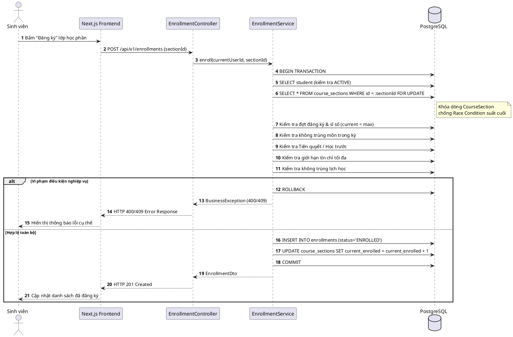
```plantuml
@startuml Sequence_Course_Enrollment
autonumber
actor "Sinh viên" as Stu
participant "Next.js Frontend" as FE
participant "EnrollmentController" as CTL
participant "EnrollmentService" as SVC
database "PostgreSQL" as DB

Stu -> FE : Bấm "Đăng ký" lớp học phần
FE -> CTL : POST /api/v1/enrollments {sectionId}
CTL -> SVC : enroll(currentUserId, sectionId)
SVC -> DB : BEGIN TRANSACTION
SVC -> DB : SELECT student (kiểm tra ACTIVE)
SVC -> DB : SELECT * FROM course_sections WHERE id = :sectionId FOR UPDATE
note right of DB : Khóa dòng CourseSection\nchống Race Condition suất cuối
SVC -> DB : Kiểm tra đợt đăng ký & sĩ số (current < max)
SVC -> DB : Kiểm tra không trùng môn trong kỳ
SVC -> DB : Kiểm tra Tiên quyết / Học trước
SVC -> DB : Kiểm tra giới hạn tín chỉ tối đa
SVC -> DB : Kiểm tra không trùng lịch học
alt Vi phạm điều kiện nghiệp vụ
  SVC -> DB : ROLLBACK
  SVC --> CTL : BusinessException (400/409)
  CTL --> FE : HTTP 400/409 Error Response
  FE --> Stu : Hiển thị thông báo lỗi cụ thể
else Hợp lệ toàn bộ
  SVC -> DB : INSERT INTO enrollments (status='ENROLLED')
  SVC -> DB : UPDATE course_sections SET current_enrolled = current_enrolled + 1
  SVC -> DB : COMMIT
  SVC --> CTL : EnrollmentDto
  CTL --> FE : HTTP 201 Created
  FE --> Stu : Cập nhật danh sách đã đăng ký
end
@enduml
```

---

### 2.4. Sequence Diagram 4: Giảng viên Nhập điểm, Tính tự động & Công bố bảng điểm

```mermaid
sequenceDiagram
    autonumber
    actor Lec as Giảng viên
    participant FE as Next.js Frontend
    participant CTL as GradeController
    participant SVC as GradeService
    participant DB as PostgreSQL

    Lec->>FE: Nhập điểm thành phần trên bảng & bấm "Lưu bảng điểm"
    FE->>CTL: PUT /api/v1/sections/{sectionId}/grades {gradesList}
    CTL->>SVC: saveSectionGrades(currentUserId, sectionId, gradesList)
    SVC->>DB: BEGIN TRANSACTION
    SVC->>DB: SELECT * FROM course_sections WHERE id = :sectionId
    alt lecturer_id != currentLecturerId hoặc grade_status != DRAFT
        SVC->>DB: ROLLBACK
        SVC-->>CTL: throw AccessDenied / InvalidState (403 / 400)
        CTL-->>FE: HTTP 403 / 400
    else Đúng GV phụ trách & đang ở trạng thái DRAFT
        SVC->>DB: UPSERT vào bảng student_grades (kiểm tra 0 <= score <= 10)
        SVC->>SVC: Tính final_score_10, xét điểm liệt cuối kỳ (< 4.0), quy đổi chữ & hệ 4
        SVC->>DB: UPDATE enrollments SET final_score_10, letter_grade, gpa_score_4, is_passed
        SVC->>DB: COMMIT TRANSACTION
        SVC-->>CTL: SectionGradeBookDto
        CTL-->>FE: HTTP 200 OK
        FE-->>Lec: Hiển thị điểm tổng kết đã tính tự động
    end

    Lec->>FE: Bấm "Công bố bảng điểm"
    FE->>CTL: POST /api/v1/sections/{sectionId}/grades/publish
    CTL->>SVC: publishSectionGrades(currentUserId, sectionId)
    SVC->>DB: Kiểm tra 100% SV ENROLLED trong lớp đã có đủ đầu điểm
    alt Còn sinh viên thiếu đầu điểm
        SVC-->>CTL: throw IncompleteGradeException (400)
        CTL-->>FE: HTTP 400 {code: "GRADE_INCOMPLETE_FOR_PUBLISH"}
    else Đã đủ 100%
        SVC->>DB: UPDATE course_sections SET grade_status = 'PUBLISHED', published_at = NOW()
        SVC->>DB: INSERT INTO audit_logs (action = 'PUBLISH_GRADES')
        SVC-->>CTL: HTTP 200 OK
        CTL-->>FE: Trạng thái bảng điểm = PUBLISHED
        FE-->>Lec: Khóa lưới nhập điểm & thông báo đã công bố
    end
```

---

### 2.5. Sequence Diagram 5: Sinh viên Tra cứu Kết quả học tập & Tính GPA/CPA

```mermaid
sequenceDiagram
    autonumber
    actor Stu as Sinh viên
    participant FE as Next.js Frontend
    participant CTL as AcademicResultController
    participant SVC as AcademicResultService
    participant DB as PostgreSQL

    Stu->>FE: Mở trang "Kết quả học tập"
    FE->>CTL: GET /api/v1/students/me/academic-results
    CTL->>SVC: getMyTranscript(currentUserId)
    SVC->>DB: SELECT student_id FROM students WHERE user_id = :currentUserId
    SVC->>DB: SELECT enrollments + course_sections + courses + semesters + student_grades của student_id
    DB-->>SVC: Danh sách toàn bộ các lần học
    SVC->>SVC: Lọc chỉ hiển thị điểm của các lớp có grade_status IN ('PUBLISHED', 'LOCKED')
    SVC->>SVC: Tính GPA từng học kỳ = Σ(gpa_4 * credits) / Σ(credits)
    SVC->>SVC: Nhóm theo course_id, lấy lần học có điểm cao nhất (BR-31) -> Tính CPA tích lũy & Tín chỉ tích lũy
    SVC-->>CTL: TranscriptResponseDto (semesters[], cpa, totalAccumulatedCredits)
    CTL-->>FE: HTTP 200 OK
    FE-->>Stu: Hiển thị biểu đồ GPA/CPA và bảng điểm chi tiết từng học kỳ
```
